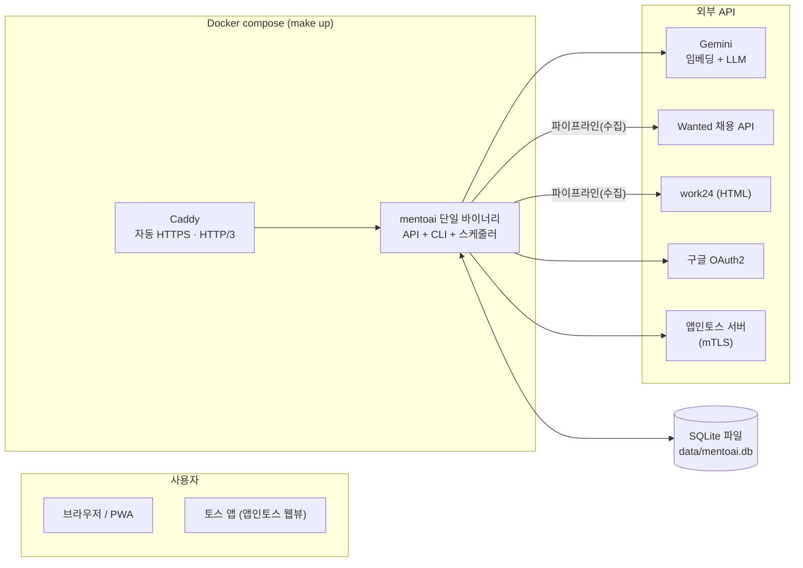
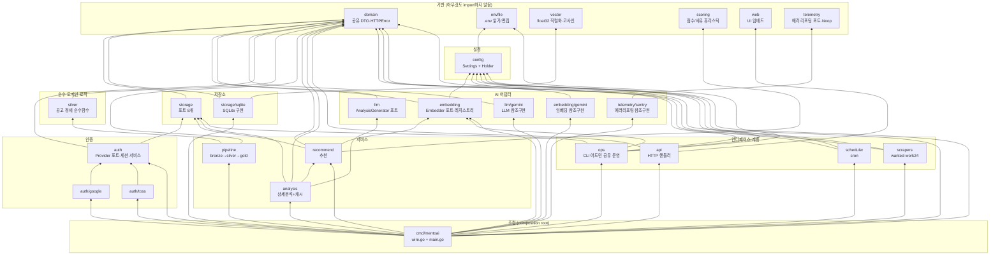
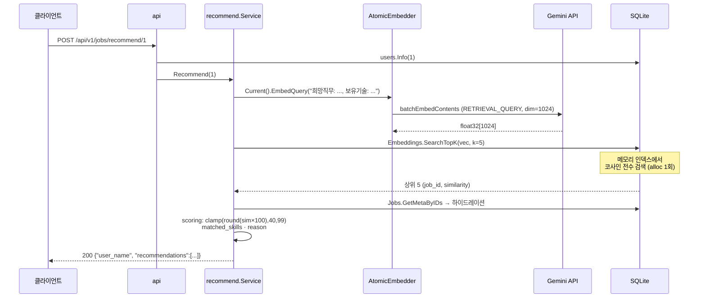
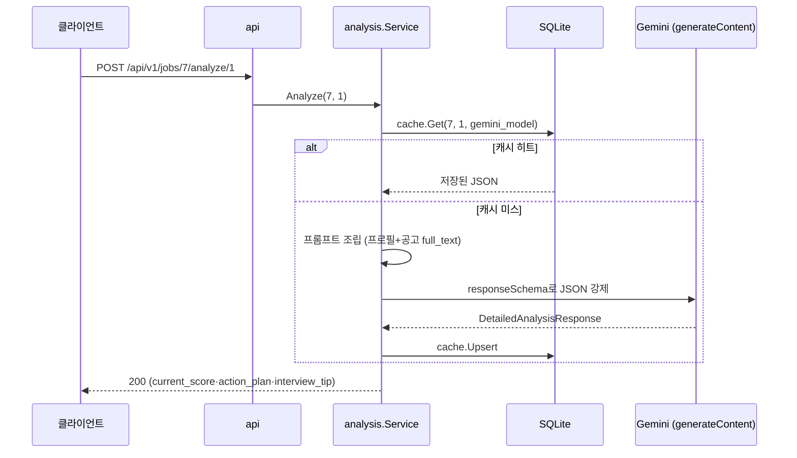
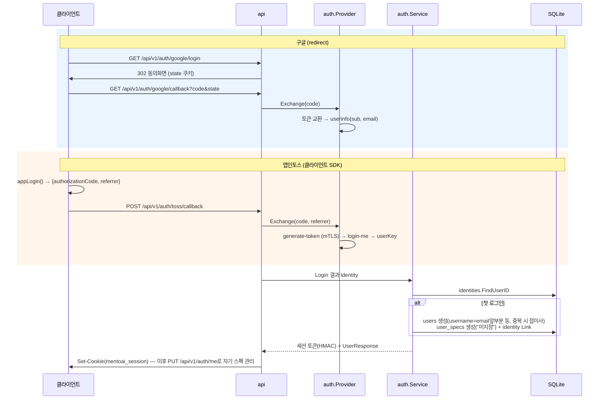

# MentoAI 아키텍처 문서

이 문서는 코드의 **실제 import 관계**(`go list`로 추출)를 기준으로 각 모듈의 의미,
책임, 의존 관계를 기술한다. 구조를 바꿀 때는 이 문서도 함께 갱신한다.

---

## 1. 시스템 개요

한 문장 정의: **채용공고를 수집·정제·임베딩해서, 사용자 스펙과의 벡터 유사도로 맞춤 공고를
추천하고, LLM이 상세 커리어 전략을 만들어주는 단일 바이너리 서비스.**



- **프로세스 1개**(또는 compose 기준 컨테이너 2개: api + caddy)로 전체 스택이 동작한다.
- 데이터베이스는 외부 서비스가 아니라 **파일 하나**(SQLite, WAL 모드)다.
- LLM/임베딩은 Gemini API 참조 구현 하나만 붙어 있고, 포트 인터페이스로 교체 가능하다.

---

## 2. 의존 규칙 (이 프로젝트의 설계 계약)

모든 모듈은 다음 5가지 규칙을 따른다. 코드 리뷰 시 이것만 보면 된다.

| # | 규칙 | 근거 |
|---|---|---|
| R1 | **소비자가 포트를 선언한다.** 인터페이스는 구현체 패키지가 아니라 이를 사용하는 패키지(api, recommend, pipeline, ops) 안에 정의된다 | 필요한 메서드만 노출하는 좁은 인터페이스(Interface Segregation) |
| R2 | **구현체는 구조적 타이핑으로 포트를 충족한다.** `storage/sqlite`는 `storage` 패키지를 import하지 않는다 | 구현 패키지가 소비자에게 결합되지 않는다 |
| R3 | **생성자 주입은 `cmd/mentoai/wire.go`(composition root)에서만.** 그 외 어느 패키지도 다른 패키지의 구체 구조체를 new하지 않는다 | 의존성 그래프의 단일 진실 지점 |
| R4 | **`internal/domain`은 모두가 import하고, domain은 아무도 import하지 않는다** | 계층 공유 DTO와 오류의 최하층 고정 |
| R5 | **순환 import 금지.** `go list`로 확인 가능하며 현재 순환은 0개다 | 위 그래프가 트리(방향 비순환)임을 보장 |

---

## 3. 패키지 의존 그래프 (실측)



읽는 법: 화살표는 "import한다"는 뜻이고, 항상 **위(소비자) → 아래(의존 대상)** 방향이다.
`storage/sqlite`, `embedding/gemini`, `llm/gemini`, `auth/google`, `auth/toss`가
각 포트의 유일한 구현체다.

---

## 4. 모듈 레퍼런스

### 4.1 기반 계층

| 모듈 | 의미 / 존재 이유 | 핵심 타입·함수 | 의존 |
|---|---|---|---|
| `internal/domain` | 모든 계층이 공유하는 데이터 모양과 오류. 각 계층이 자기 DTO를 만들면 변환 지옥이 되므로 한곳에 모은다 | `UserSummary`, `JobSummary`, `DetailedAnalysisResponse`, `Status`, `SilverRow`, `RawRecord`, `SearchHit`, `HTTPError`(404/409/422/500 헬퍼) | 없음 |
| `internal/envfile` | `.env` 읽기 + **줄 보존 편집기**. 임베딩 모델 전환이 파일을 통째로 재작성하지 않고 주석·순서를 유지하게 하기 위해 존재 | `Load`(환경변수 반영, 기존값 우선), `Update`(in-place 교체 + `.bak` 백업), `HasKey` | 없음 |
| `internal/vector` | 임베딩 벡터의 물리 표현. SQLite BLOB ↔ `[]float32` 변환과 유사도 수학을 앱 전체에서 한 곳에 모은다 | `Encode`(float32 LE), `Decode`, `Cosine` | 없음 |
| `internal/scoring` | LLM 없이 즉시 계산되는 추천 점수/사유 규칙. 원본 Python과 결과가 1:1인 순수 함수들 | `SimilarityToScore`(clamp 40~99), `SkillOverlap`, `BuildReason`, `CareerLabel` | 없음 |
| `internal/web` | 바닐라 JS PWA를 바이너리에 박제(`embed.FS`). 빌드 도구 없이 정적 UI를 같은 프로세스에서 서빙 | `FS()` |
| `internal/telemetry` | 에러 리포팅의 포트. api·pipeline·ops가 이 포트에만 의존하고, `SENTRY_DSN` 미설정 시 **Noop**(완전 off)이 주입된다 | `Reporter`(CaptureError/Close), `Noop()` |
| `internal/telemetry/sentry` | **참조 구현** — Sentry SaaS로 에러를 비동기 전송(블로킹 없음, 초과 시 드롭). 바이너리 +~2MB, RAM 영향 수 MB 이하 | `New(dsn, env)`(빈 DSN → Noop), `CaptureError`(태그 지원), `Close`(종료 시 플러시) | 없음 |

### 4.2 설정

| 모듈 | 의미 | 핵심 타입·함수 | 의존 |
|---|---|---|---|
| `internal/config` | `.env`+환경변수를 타입 있는 `Settings`로. **Holder**가 있는 이유: 임베딩 모델 전환이 실행 중에 설정을 갈아끼우기 때문 | `Settings`(전 필드), `Load`, `Holder.Get/Set`(RWMutex) | envfile |

### 4.3 저장소 (포트 + 구현)

| 모듈 | 의미 | 포트 ↔ 구현 |
|---|---|---|
| `internal/storage` | **포트만** 정의. 저장 기술을 모르는 서비스 계층이 의존하는 대상 | `UserRepo`, `RawPostingRepo`, `JobRepo`, `EmbeddingRepo`, `CacheRepo`, `RunRepo`, `IdentityRepo`, `SizeProbe` |
| `internal/storage/sqlite` | SQLite 구현. Medallion(bronze→silver→gold)이 파일 하나 안에 녹아 있다 | 위 포트 8개 전부를 **구조적 타이핑**으로 구현 + `ApplyMigrations`(embed.FS 마이그레이션 러너) |

`storage/sqlite` 내부 구성:

- `storage.go` — Open(DSN pragma: WAL·NORMAL·foreign_keys·txlock=immediate), 마이그레이션 러너, 고정폭 UTC 타임스탬프 유틸
- `users.go` / `raw.go` / `jobs.go` / `embeddings.go` / `cache.go` / `runs.go` / `identities.go` — 테이블별 repo
- `migrations/001_init.sql`, `002_auth_identities.sql` — 스키마 (파일명 순서로 1회 적용, `schema_migrations` 추적)
- `embeddings.go`의 메모리 인덱스: `(job_id, 벡터, 노름)` 전량을 지연 로딩 캐시 → 코사인 전수 검색 top-K.
  쓰기(`UpsertMany`/`DeleteAll`)와 공고 삭제 시 `Invalidate()`. 1만 건×1024차원 ≈ 20ms, alloc 1회/op (벤치: `bench_test.go`)

### 4.4 AI 어댑터

| 모듈 | 의미 | 핵심 |
|---|---|---|
| `internal/embedding` | 임베딩 공급자의 **포트와 교체 장치**. "공급자를 런타임에 갈아끼우는" 요구에서 출발 | `Embedder`(EmbedDocuments/EmbedQuery/ModelKey/Dim), `Registry.Register/Resolve/Build`, `AtomicEmbedder`(실행 중 전환), `Prefixes`(E5 계열용, 로컬 구현 확장 대비) |
| `internal/embedding/gemini` | **참조 구현**. 표준 REST만으로 구현해 SDK 의존 0 | `batchEmbedContents` 호출(100건 배치), `RETRIEVAL_DOCUMENT/QUERY` task type, `outputDimensionality=1024`. 키 미설정 시 기동은 되고 호출 시에만 실패 |
| `internal/llm` | 상세 분석 생성의 포트 | `AnalysisGenerator` |
| `internal/llm/gemini` | 구조화 출력 참조 구현. `responseSchema`로 응답 JSON 모양을 강제한다 | `generateContent` + `responseSchema`(DetailedAnalysisResponse 매핑) |

새 공급자 추가 절차: `Embedder` 구현 → `wire.go`에서 `registry.Register("이름", ...)` 한 줄.
`switch-embedding`/어드민 전환 API가 레지스트리를 보므로 이후 코드 변경은 없다.

### 4.5 인증

| 모듈 | 의미 | 핵심 |
|---|---|---|
| `internal/auth` | 로그인의 공통 뼈대. 공급자별 차이는 `Provider` 포트 뒤로 숨기고, 세션은 DB 없는 **HMAC-SHA256 서명 토큰**(쿠키+Bearer, 30일) | `Provider`(Enabled/LoginURL/Exchange), `SessionManager`(Issue/Verify/FromRequest, 상수시간 비교), `Service`(첫 로그인 자동 회원가입, `auth_identities` 매핑, Me/UpdateMe) |
| `internal/auth/google` | 표준 OAuth2(OIDC) 구현. redirect 방식 — 동의화면 URL 생성 + 코드 교환 + userinfo | 302 리다이렉트, `state` 쿠키로 CSRF 방어 |
| `internal/auth/toss` | 앱인토스(토스 로그인). redirect 방식이 아니라 **클라이언트 SDK `appLogin()`의 인가 코드를 우리 API가 받아** 서버간 교환 | `generate-token`(**mTLS 클라이언트 인증서** — cert/key 경로 주입) → `login-me` → `userKey` |

모든 공급자는 **설정이 채워진 것만 활성화**된다. 값이 비어 있으면 기존 무인증 동작과 완전히 동일.

### 4.6 도메인 로직 (순수 함수)

| 모듈 | 의미 | 핵심 |
|---|---|---|
| `internal/silver` | bronze 원본을 통합 스키마로 정제하는 규칙 모음. I/O가 없어 단위 테스트만으로 검증된다 | `CleanText`(HTML 제거·공백 정규화), `NormalizeWanted`/`NormalizeWork24`(필드 매핑), `BuildFullText`(`[회사]~[위치]` 섹션 합성 — 임베딩 입력), `Build`(정제 + keep-last 중복제거) |
| `internal/scoring` | 추천 점수화 규칙 — 위 4.1 참고 | similarity→점수, 스킬 일치, 경력 부족 사유 |

### 4.7 파이프라인

| 모듈 | 의미 | 핵심 |
|---|---|---|
| `internal/pipeline` | Medallion 파이프라인. 각 단계가 함수 하나(`Bronze`/`Silver`/`Gold`)라서 CLI·스케줄러·어드민이 같은 코드를 쓴다 | `Bronze`(스크래퍼 격리 — 한 소스 실패가 전체를 죽이지 않음), `Silver`(전량 재정제 + upsert, `updated_at` 갱신), `Gold`(Pending=신규/stale/모델불일치 재임베딩, 차원 불일치 하드 에러), `RunPipeline`(이력 기록 success/failed + 실패 단계 `stage` 태그로 리포팅) |
| `internal/scrapers` | 수집기 2종. `Scraper` 시그니처 한 개로 파이프라인에 주입된다 | `wanted`(JSON API 페이지네이션+랜덤 지연), `work24`(goquery HTML 파싱 — 리스트/상세, 정규식 추출) |

### 4.8 서비스

| 모듈 | 의미 | 핵심 |
|---|---|---|
| `internal/recommend` | "이 사람에게 어떤 공고인가" — 벡터 유사도 + 휴리스틱. **LLM 0호출**로 즉시 응답 | `Recommend`: 프로필 텍스트 임베딩 → `SearchTopK` → `GetMetaByIDs` 하이드레이션 → scoring |
| `internal/analysis` | "이 공고에 뭐가 부족한가" — Gemini 상세 컨설팅. **(job, user, model)당 호출 1회** 캐시 | `Analyze`: 캐시 확인 → 프롬프트 조립(원본 프롬프트 그대로) → `GenerateAnalysis` → 캐시 저장 |
| `internal/ops` | CLI와 어드민 API가 **항상 같은 로직**을 돌리게 하는 공유 운영 계층. 여기에 없는 기능은 양쪽 인터페이스에 노출하지 않는다 | `Status`(카운트·용량·모델·스케줄), `ListJobs/DeleteJob`, 사용자 CRUD, `RebuildEmbeddings`, `SwitchEmbeddingModel`(.env 갱신→구현체 교체→전량 재임베딩), 캐시 관리, `Guard`(이름 기반 중복 실행 409) |
| `internal/scheduler` | 파이프라인 cron 스케줄러. `SCHEDULE_ENABLED`일 때만 시작 | `Start`(robfig/cron, `SkipIfStillRunning`+`Recover`), `Info`(다음 실행시각 — live 스케줄러 또는 cron 계산) |

### 4.9 인터페이스 계층

| 모듈 | 의미 | 핵심 |
|---|---|---|
| `internal/api` | HTTP 진입점. **프레임워크 없는** net/http ServeMux(Go 1.22 패턴 라우팅) | v1 3개 + 어드민 14개 + auth 7개 엔드포인트. FastAPI와 동일한 계약 유지: 상태코드(201/204/409/422), 에러 바디 `{"detail": ...}`, 한국어 메시지. `guard` 미들웨어는 `AUTH_REQUIRED=true`일 때만 admin·jobs에 401 게이트. **포트를 자체 선언**(UsersLister/Recommender/Analyzer/AdminService/Auth...)해 테스트에서 가짜 주입 |
| `internal/web` | 위 4.1 — api가 `FileServerFS`로 서빙 | index/admin/app.js/sw.js/아이콘 |

### 4.10 조립 (composition root)

| 모듈 | 의미 | 핵심 |
|---|---|---|
| `cmd/mentoai` | 유일하게 **구현체 생성을 허용하는** 패키지 | `wire.go`: 저장소 열기 → 설정 Holder → 임베딩 레지스트리+활성 구현체 → 파이프라인 deps → 서비스들 → ops → auth → api 서버. `main.go`: CLI 서브커맨드(serve/migrate/seed/scrape/transform/embed/pipeline/status/models/switch-embedding/jobs/users) + serve의 graceful shutdown |

---

## 5. 핵심 흐름

### 5.1 맞춤 공고 추천 (LLM 0호출 — 밀리초 응답)



### 5.2 상세 커리어 분석 (Gemini 1회, 이후 캐시)



### 5.3 파이프라인 (스케줄·CLI·어드민이 같은 코드)

```mermaid
flowchart LR
    RUN["RunPipeline"] --> H1["pipeline_runs<br/>status=running 기록"]
    H1 --> B["Bronze: wanted+work24 수집<br/>(실패 소스 격리)"]
    B --> RAW["bronze_raw_postings<br/>원본 JSON upsert"]
    RAW --> S["Silver: silver.Build<br/>정제·keep-last dedup·full_text"]
    S --> SJ["silver_jobs upsert<br/>updated_at = now"]
    SJ --> G["Gold: Pending 조회<br/>신규 ∨ stale ∨ 모델불일치"]
    G --> EMB["Gemini 임베딩 (100건 배치)"]
    EMB --> SE["silver_job_embeddings upsert<br/>→ 메모리 인덱스 무효화"]
    SE --> FIN["pipeline_runs<br/>success/failed 기록"]
```



stale 판정은 `e.embedded_at < j.updated_at` (문자열 비교 = 시간 비교, 고정폭 UTC 포맷)와
`e.model <> 현재 ModelKey` 두 조건. 즉 공고가 갱신되거나 임베딩 모델을 바꾸면 자동 재임베딩된다.

### 5.4 로그인 (구글 = redirect 방식, 앱인토스 = 코드 POST 방식)



### 5.5 임베딩 모델 전환 (무중단 교체)

`switch-embedding`/어드민 전환 → `Registry.Resolve`(검증) → `envfile.Update`(.env 백업·갱신) →
`config.Holder.Set`(프로세스 설정 교체) → `Registry.Build`로 새 `Embedder` 생성 →
`AtomicEmbedder.Swap`(진행 중 요청은 기존 구현 완료, 이후 요청은 새 모델) →
임베딩 전량 삭제 → gold 재임베딩. 이후 gold의 Pending 조건(`model <> 새키`)이 자동으로
전량 재임베딩을 보장한다.

---

## 6. 데이터 모델

```mermaid
erDiagram
    users ||--|| user_specs : "스펙 1:1"
    users ||--o{ auth_identities : "외부 신원 N"
    users ||--o{ analysis_cache : "분석 캐시"
    silver_jobs ||--|| silver_job_embeddings : "임베딩 1:1"
    silver_jobs ||--o{ analysis_cache : "분석 캐시"
    bronze_raw_postings {
        text source
        text source_id
        text payload "원본 JSON"
    }
    users {
        integer id PK
        text username UK
    }
    user_specs {
        integer user_id PK_FK
        text desired_job
        integer career_years
        text skills "JSON 배열"
    }
    auth_identities {
        text provider PK
        text provider_user_id PK
        integer user_id FK
    }
    silver_jobs {
        integer id PK
        text source
        text source_id
        text company
        text position
        text skill_tags "JSON 배열"
        text full_text "임베딩 입력"
        text updated_at
    }
    silver_job_embeddings {
        integer job_id PK_FK
        blob embedding "float32 LE"
        text model "provider:model"
        text embedded_at
    }
    analysis_cache {
        integer job_id PK_FK
        integer user_id PK_FK
        text model PK
        text response "LLM 응답 JSON"
    }
    pipeline_runs {
        integer id PK
        text status
        integer scraped
        integer silver_upserted
        integer embedded
        text error
    }
```

**저장 표현 규칙** (PostgreSQL 원본 → SQLite 이행 대응):

| 원본 타입 | SQLite 표현 | 규칙 |
|---|---|---|
| `vector(1024)` | `BLOB` | float32 little-endian. 검색은 프로세스 메모리 인덱스 |
| `text[]` | `TEXT` | JSON 배열 (`["Go","SQL"]`) |
| `jsonb` | `TEXT` | JSON 그대로 |
| `timestamptz` | `TEXT` | **고정폭** 나노초 UTC (`2006-01-02T15:04:05.000000000Z`) — 자릿수 고정이라 문자열 비교가 곧 시간 비교. `embedded_at < updated_at` stale 감지가 이 비교에 의존한다 |
| 스키마 `bronze.`/`silver.` | 테이블 접두사 `bronze_`/`silver_` | SQLite는 스키마가 없어서 접두사로 계층을 표현 |

---

## 7. 설정 참조 (환경변수)

| 그룹 | 변수 | 기본값 | 설명 |
|---|---|---|---|
| DB | `SQLITE_PATH` | `data/mentoai.db` | SQLite 파일 경로 |
| 서버 | `SEED_ON_START` | `false` | 기동 시 샘플 사용자 자동 적재(멱등) |
| LLM | `GOOGLE_API_KEY` | (빈 값) | Gemini 임베딩·LLM 공용 키 |
| LLM | `GEMINI_MODEL` | `gemini-3-flash-preview` | 상세 분석 모델 |
| 임베딩 | `EMBEDDING_PROVIDER` | `gemini` | 레지스트리에 등록된 공급자 |
| 임베딩 | `GEMINI_EMBEDDING_MODEL` / `EMBEDDING_DIM` | `gemini-embedding-001` / `1024` | |
| 수집 | `WANTED_BASE_URL` / `WANTED_JOB_GROUP_ID` / `WANTED_JOB_IDS` | wanted.co.kr / 518 / 655 | |
| 수집 | `SCRAPE_MAX_ITEMS` / `SCRAPE_DELAY_SECONDS` | 120 / 0.4 | 예의 있는 크롤링 |
| 스케줄 | `SCHEDULE_ENABLED` / `SCHEDULE_CRON` / `SCHEDULE_TIMEZONE` | false / `0 9,16 * * *` / Asia/Seoul | |
| 추천 | `RECOMMEND_TOP_K` | 5 | |
| 인증 | `AUTH_SECRET` | (빈 값) | 세션 서명 키 — 로그인 마스터 스위치 |
| 인증 | `AUTH_REQUIRED` | `false` | true면 admin·jobs API에 로그인 강제 |
| 인증 | `AUTH_COOKIE_SECURE` | `false` | HTTPS 뒤 운영 시 true |
| 인증 | `GOOGLE_CLIENT_ID` / `GOOGLE_CLIENT_SECRET` / `GOOGLE_REDIRECT_URL` | | 채워지면 구글 로그인 활성화 |
| 인증 | `TOSS_MTLS_CERT_PATH` / `TOSS_MTLS_KEY_PATH` / `TOSS_API_BASE_URL` | | 채워지면 토스 로그인 활성화 |
| 배포 | `CADDY_DOMAIN` | `localhost` | 실도메인이면 Let's Encrypt 자동 발급 |

---

## 8. 배포 토폴로지

- `make up` / `bash scripts/deploy.sh` → compose가 **api + caddy** 두 컨테이너를 띄운다.
- api는 호스트에 포트를 노출하지 않는다(내부망 only). Caddy가 80/443(tcp)+443/udp을 받아
  `reverse_proxy api:8000`으로 프록시한다.
- Caddy: HTTPS 자동 발급(localhost = 내부 CA, 실도메인 = Let's Encrypt), HTTP/3 기본 활성,
  308 리다이렉트, zstd/gzip, 보안 헤더(HSTS·nosniff·X-Frame-Options).
- api 이미지: distroless + 비root(65532). `/data` 볼륨 소유권을 이미지에 심어 nonroot로도 기록 가능.
  `GOMEMLIMIT=64MiB`로 GC 소프트 리밋.
- 우분투 신규 서버: `scripts/setup-ubuntu.sh`(Docker 설치) → `scripts/deploy.sh`(나머지 전부).
- 단일 컨테이너 변형은 `deploy/Dockerfile.single` (단, 앱 크래시 시 컨테이너가 Up으로
  위장하는 결함이 있어 기본은 compose를 권장).

---

## 9. 확장 가이드 (포트별 교체 방법)

| 신호 | 교체 대상 포트 | 방법 |
|---|---|---|
| 벡터 수십만 건+ (검색 메모리/시간) | `storage.EmbeddingRepo` | pgvector/Qdrant 구현 패키지 추가 → wire.go 조립만 교체. `SearchTopK` 계약(유사도 내림차순 hits) 불변 |
| 데이터가 단일 파일 한계를 넘을 때 | 저장소 포트 전체 | `storage/postgres` 구현 추가 — 포트가 이미 분리되어 있어 소비자 무수정 |
| 임베딩 공급자 추가/교체 (로컬 ONNX, OpenAI 등) | `embedding.Embedder` | 구현 + `registry.Register` 한 줄. E5 계열은 `embedding.Prefixes` 재사용 |
| LLM 교체 | `llm.AnalysisGenerator` | 구현 교체 — 프롬프트와 캐시는 analysis 서비스에 그대로 |
| 수집 소스 추가 | `pipeline.Scraper` | 함수 하나 구현 후 deps.Scrapers에 추가 (실패 격리는 파이프라인이 처리) |
| OAuth 공급자 추가 (카카오·네이버 등) | `auth.Provider` | 구현 + providers 슬라이스에 추가. 상태/엔드포인트/UI는 자동 반영 |

---

## 10. 테스트 지도

| 패키지 | 테스트 | 방식 |
|---|---|---|
| `internal/scoring`, `silver`, `envfile`, `vector` | 순수 함수 테이블 테스트 | I/O 없음, `t.Parallel` |
| `internal/storage/sqlite` | 실제 SQLite(임시 파일) 통합 + **벤치마크**(`b.Loop`, allocs 추적) | 마이그레이션 포함 실제 쿼리 검증 |
| `internal/embedding`, `llm` | 포트 계약 + 레지스트리 | 가짜 구현 |
| `internal/embedding/gemini`, `llm/gemini`, `auth/google`, `auth/toss` | HTTP 계약 | `httptest` 가짜 서버(요청 본문·헤더 검증) |
| `internal/auth` | 세션 서명·만료(**synctest 가상 시간**) + 로그인 통합(실 SQLite) | 가짜 Provider + 실 저장소 |
| `internal/api` | 핸들러 전수(상태코드·에러 바디·정적 셸·게이트) | 가짜 서비스 생성자 주입 |
| `internal/pipeline` | bronze 격리·silver 정제·gold 차원 불일치·이력 기록 | 실 SQLite + 가짜 수집기/임베더 |

실행: `make test` (= `go test -race -shuffle=on ./...`). 심화 fuzz:
`go test ./internal/auth/ -fuzz FuzzSessionVerify -fuzztime 30s` 등.
정적 검사는 CI에서 gofmt·vet·staticcheck을 돌린다.
